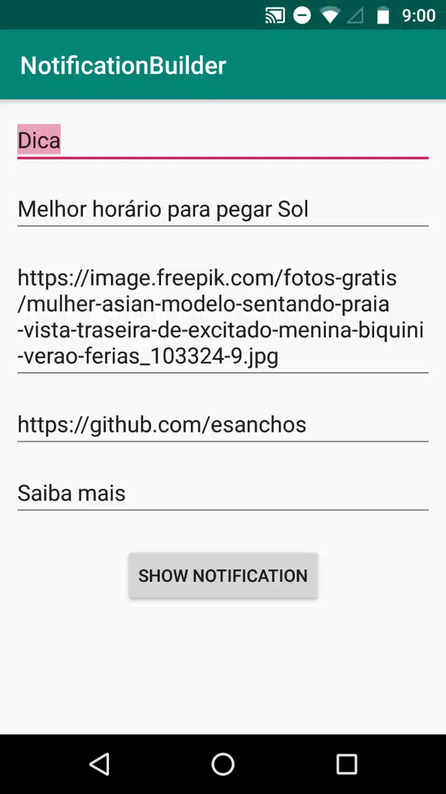
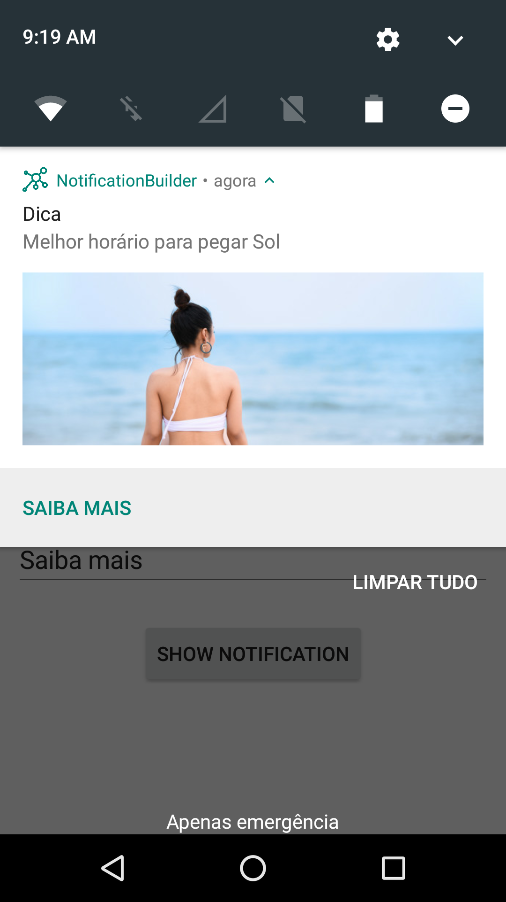

# Notification Builder Sample  
  



This is a simple sample showing how to create a local notification. Feature:  
- Expandable Big image  
- Action Button  
  
It is also possible to show this notification remotely from FCM:  

POST https://fcm.googleapis.com/fcm/send
```json  
{  
   "content_available": true,  
   "priority": "high",  
   "data": {  
      "title":"{TITLE}",  
      "content":"{CONTENT_TEXT}",  
      "image_url":"{BIG_IMAGE_URL}",  
      "url":"{ACTION_URL}",  
      "link_ext":"{ACTION_BUTTON_TEXT}",  
   },  
   "to": "/topics/all"  
}  
```
(don't forget to include the Authorization: key=XXXX to the header of your request)
